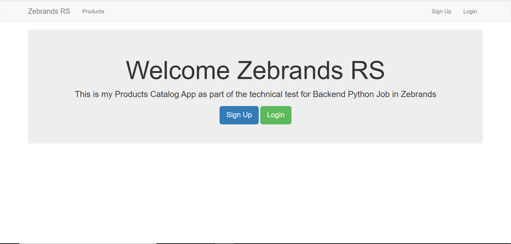
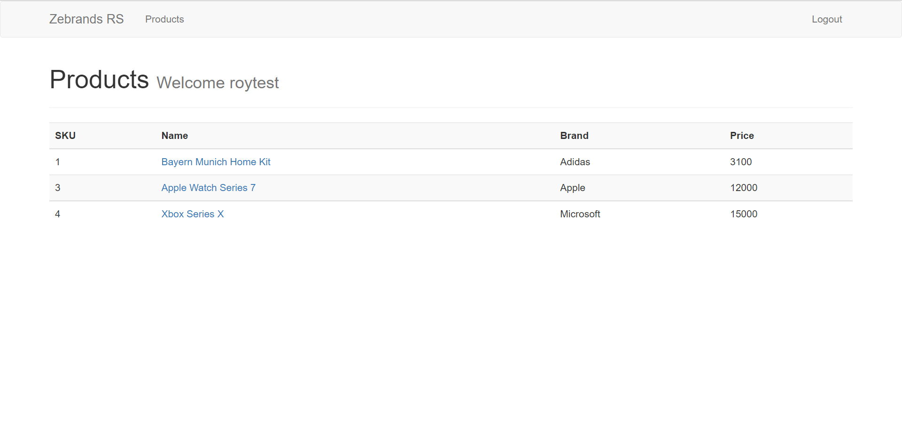
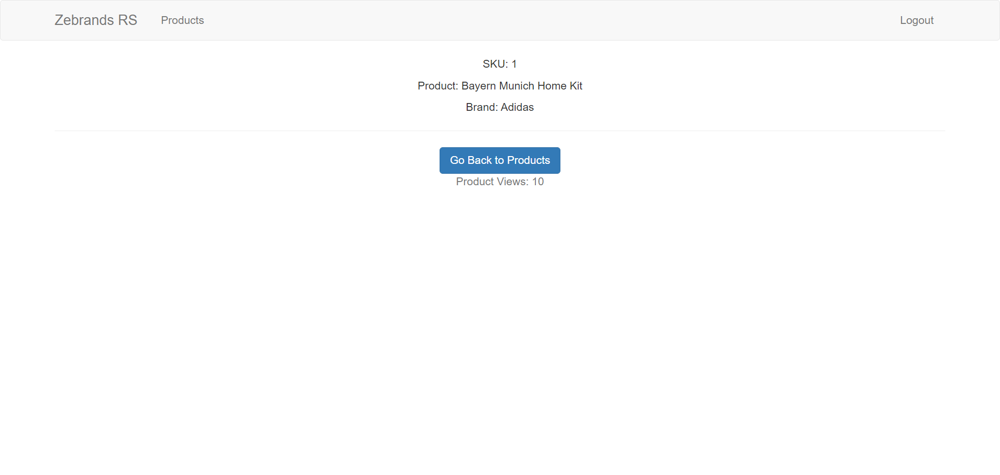
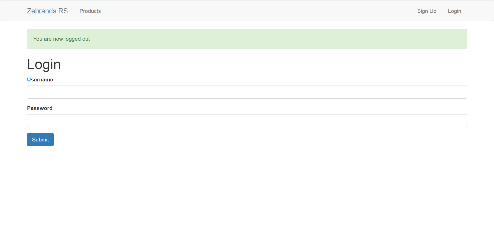
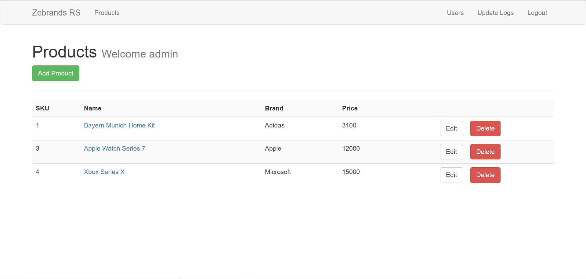
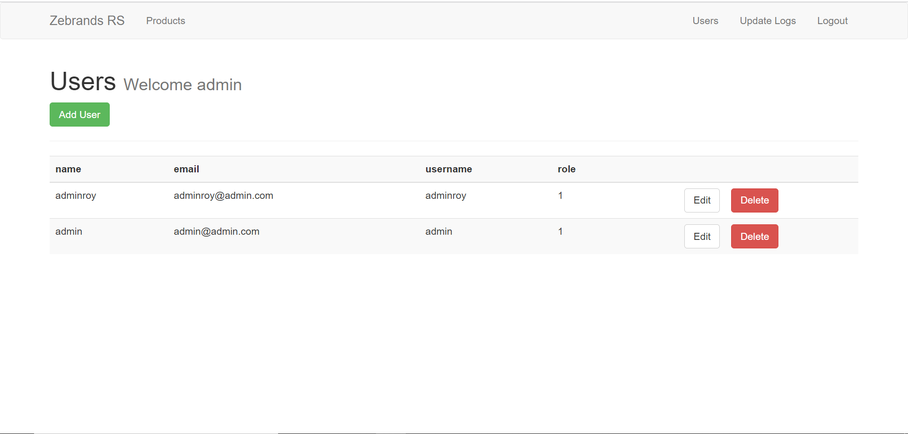
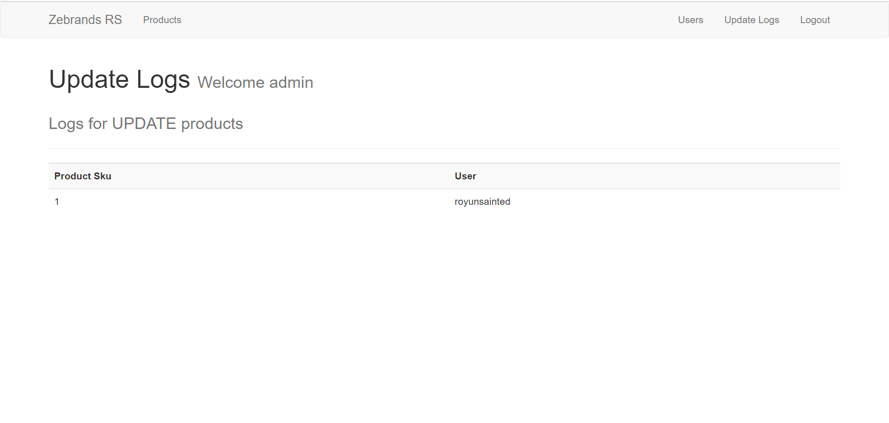

# ZebrandsRS

## Backend Technical Test Rogelio Salazar

## Pre-requisites
```
pip install flask
```

```
pip install flask-mysql
```

```
pip install flask-wtf
```

```
pip install passlib
```

## Run the App.
Once every  library has been installed, just need to execute the following command.
```
python app.py
```

## Interface
This is the home page of the App, where you can login or register to access the page.
 

Once logged as a user, you will be able to see the available products in the catalog.


You can click on any product to see its page, every user visit will increase the views
of the product.


You can logout by clicking on the `logout` button located top-right of your screen.


Now by signing-in as an admin, you will be able to `ADD`, `EDIT` or `DELETE` a product.


In addition, an admin will be able to `ADD` any type of user, and `EDIT` or `DELETE` an
admin user.


Update Logs is available to review all the update history on any product.


### To acces as an admin
```
username: admin
```

```
password: 123456
```